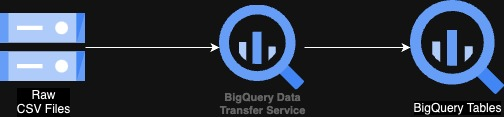
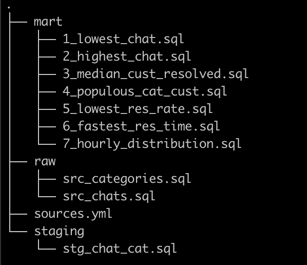
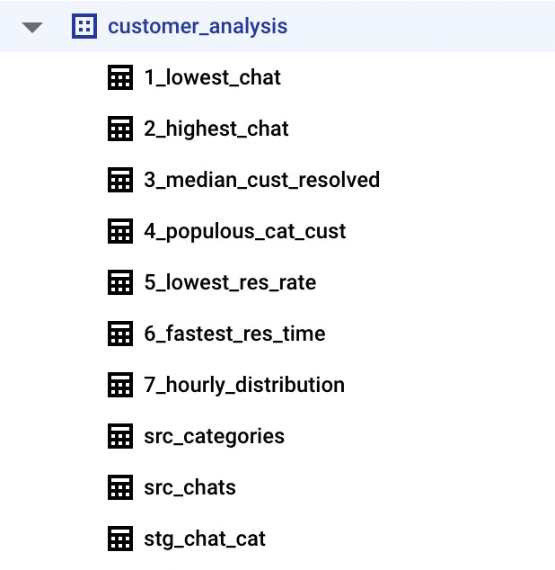
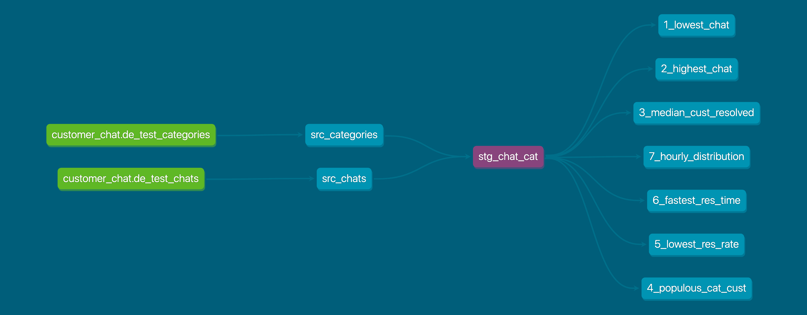

## Data Governance
We need to have Data Governance in place to make sure that the data that we store and use is secure, private, accurate, available and usable.

## Quality
To have a proper analysis done, we need to be sure that the data that is used for the analysis is of high quality. 

We can setup data quality checks to continuously monitor the data. First we need to define what are the expected formats and values for each of the columns.

1.  How would you measure the overall data quality of these files?
    
    Establish key performance indicators to measure the data quality like accuracy, completeness and accuracy.

2. What measures would you put in place to identify issues which would effect data quality?

    Data Profiling: We could Data Profiling in tools like BigQuery to monitor the data distribution and trends

    Manual Data Review : Regular manual data review of samples would help identify inconsistencies 

    Alert Systems : Setup pipelines to send notifications on Slack, Teams etc when the data quality metric falls below acceptable thresholds

3.  What would you do with invalid data that is identified?

    This really depends on the percentage of invalid data and the domain. Simplest option would be just delete all the invalid data and continue with the data pipeline as if those records didn't exist.

    Other approach could be ignore the records for the data pipeline but keep a track of this records in a seperate table that needs to be manually reviewed by an expert to identify the reason for the same.

    Another approach would be to stop the pipeline from running unless someone interferes and corrects the data. 

## Sensitivity

1.  What measures will need to be taken in controlling access to this open text data?
    Setup access to the GCS Buckets to provide access only to a group 
    

2. What measures would you put in place regarding its secure storage?

    Setup permissions on the GCS Buckets to restrict access. Use ACLs for fine-grained access to the files.
    Enable encryption on the buckets. We can choose between Google provided encryption or use KMS for manually rotating the keys on a set timeframe like 90 days.
    Enable logging on the buckets to detect any potential security breach. 
    Decide on how long the data has to be retained and setup auto deletions if the data is no longer needed.

3. If redaction of sensitive text was necessary, how would you tackle it?
    
    Since we have our data stored in GCS buckets and we create a BigQuery table to handle the data, we can use the GCP native Cloud Data Loss Prevention (DLP) to detect and redact sensitive information. If cost needs to be in check, we can use Named Entity Recognition (NER) to scan the text and find any sensitive information.
    

## Data Pipeline
To build the data pipeline, we could have multiple options using different tech stacks.

1. Option 1 - Using Databricks

    With this approach we would use only Databricks for our entire project. Databricks provides multiple options for us like Data Governance with Unity Catalog, ingest data real time with Delta Live tables, provides ACID compliance using Delta Lake.

    With this approach we could build 2 pipelines, one for ingesting raw csv files for the chats and categories and other pipeline for consuming these tables and creating analysis. 

2. Option 2 - Apache Spark pipeline using Dataproc

    If the team is comfortable using Apache Spark but doesn't want to get into a new product like Databricks, then using Dataproc could be an option. 

    Similar to option 1, we could build 2 pipelines - one for consuming the raw csv files and appending data onto the source tables and the other pipeline to do the analysis

3. Option 3 - Cloud Dataflow
    
    If the team wants to take a new route or already explored Apache Beam, then using Cloud Dataflow could be an option. This might have the most learning curve compared to other options, but the results are comparatively faster as well. Since Apache Beam does a unified method for data processing, it would be very easy to change a batch job to a streaming one without much change.

4. Option 4 - Pure Python processing
    
    If we don't want to use any particular framework like Apache Spark or Apache Beam, we could even write a simple Python script using Pandas and deploy it using Cloud Run.

    The only downside would be that the data has to fit in memory and doesn't scale as much. But the setup could be faster to get the PoC working.

5. Option 5 - Using dbt

    If the team is comfortable in writing SQL scripts for running the analysis, then this could be a best option (Dataform could also be one).

For our project we would use Option 5.

To keep the setup simple, we could use BigQuery Data Transfer Service. Whenever files are placed in the Cloud Storage Bucket the service can be scheduled to process the files and append the entries to the existing BigQuery Tables. 

Below Diagram shows the flow. 

I have written an article explaining about BigQuery Data Transfer service in detail which can used as reference.

[BigQuery Data Transfer Service Article](https://datadevhub.com/posts/bigquery-data-transfer/)

Once we have the chats and categories as BigQuery tables, we could build our dbt pipeline to process the data and do the analysis needed. 

In our case, we could produce BigQuery tables for each of our metric. With the data available, we could use Tableau or Looker to build a visualisation layer.

We would create our dbt data pipeline with the below folder structure:

    raw     : this holds the raw data read from the 2 source tables
    staging : this holds the joined tables of the chats and categories
    mart    : this holds the models for our final analysis

Our dbt data pipeline would follow the below architecure. Our dbt job would be deployed as a Cloud Run Job which would read the BigQuery source tables and writes the data back to BigQuery tables which would be consumed for our analysis.

After running the pipeline with the command `dbt run`, we could see that the tables are populated which can be used for our analysis.

Our final lineage for our data pipeline would look like below which reads 2 source tables, transformed into staging and finally to 7 tables at the mart level.

## Other Enhancements
These are the below items which we can include if more time is spent and also in a production use case

1. We could add more tests under dbt/tests to see data violations. We could also use [dbt_expectations](https://hub.getdbt.com/calogica/dbt_expectations/latest/) if we need more complex data quality checks

2. We could add the code logic to put the dbt pipeline inside a docker container and then deploy it as a Cloud Run Job. I have written a [multi-part series](https://datadevhub.com/posts/dbt-in-cloud-run-part1/) on deploying a dbt job as a Cloud Run Job.

3. We could use Terraform to manage the infra needed for our project and use GitHub Actions for the CI/CD needed

4. 